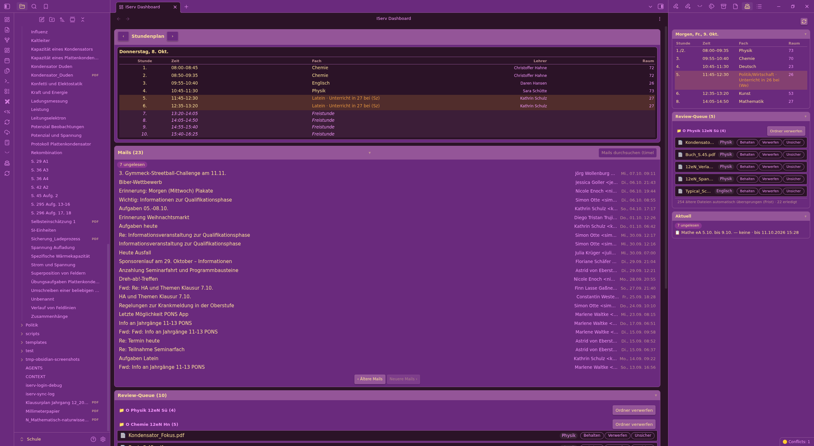

# Issue #12 Teil 2d — Folder-Reject-UI live: Ordner-Gruppierung + per-Ordner-Verwerfen

**Datum:** 08.10.2026 · Screenshot: `docs/proofs/issue12-folder-reject-ui.png`

## Beweis-Aussage

Am laufenden Obsidian (ECHTES IServ, Plugin via disable/enable gereloadet, kein Neustart):

1. **Ordner-Gruppen-Köpfe im DOM:** `4 × .iserv-queue-folder-head` (2 Views: Dashboard-Bottom-Section
   + Sidebar-Rechts-View), Labels `"📁 O Physik 12eN Sü (4)"`, `"📁 O Chemie 12eN Hn (5)"` —
   je 1 × `.iserv-queue-folder-discard`-Button. Gruppen mit < 2 offenen Items bekommen bewusst
   keinen Header (Einzeln-Zeilenaktion reicht).
2. **Verwerfen-Action wirksam:** Klick auf "Ordner verwerfen" (Chemie, 5 offene Items) →
   Confirm-Modal `".iserv-folder-discard-modal"`: „Ordner verwerfen? Der IServ-Ordner
   ‚O Chemie 12eN Hn' … (5 offene Dateien werden verworfen)." → OK:
   - `deniedAfter: true` (`Groups/O Chemie 12eN Hn` im DeniedFoldersStore, persistiert via data.json)
   - `chemNeuAfter: 0`, `chemDiscarded: 10` (Vorher Bestand 5 + frische 5)
   - Log-Zeile: `queue-folder-discard: Groups/O Chemie 12eN Hn (5 Items)` + Notice
3. **Denied-Effekt am Feed:** danach `core.trigger` → Chemie bleibt draußen: `chemNeuAfterFeed: 0`
   (feed-seitiges `deniesFolder`-Gate greift am nächsten Sync).
4. **Test-Cleanup verifiziert:** `store.allow("Groups/O Chemie 12eN Hn")` → `deniedNow: false`,
   10 discarded-Items zurück auf "neu" (Nonce-Test-Zustand vollständig retour — Live-Gate reproduzierbar).

## Layer

- **Pure** `src/review-queue/folder-groups.ts`: `groupQueueByFolder` (nur offene Items mit
  `Groups/`-Anker, Reihenfolge = erster Auftreten), `folderDiscardPayload` (Gruppe + offene
  Item-IDs + Ordnerpfad inkl. `QUEUE_FEED_ROOT`). 5 Node-Tests.
- **Render** `src/views/sidebar-render.ts`: Gruppen-Köpfe + „Ordner verwerfen"-Button
  (stopPropagation — kein Zeilen-Preview-Trigger), `QueueBindOptions.onFolderDiscard?` undefined
  = Alt-Verhalten. CSS: `.iserv-queue-folder-head/-name/-discard` + Confirm-Modal.
- **Host** `src/main.ts`: `onFolderDiscard` → `FolderDiscardConfirm` (Modal, ADR-0005-
  Bewusstseins-Gate, kein Silent-Write) → `DeniedFoldersStore.deny+save` + alle offenen
  Items `discarded` + Notice + Refresh.

740/740 Tests grün (5 neue), tsc --noEmit clean.
