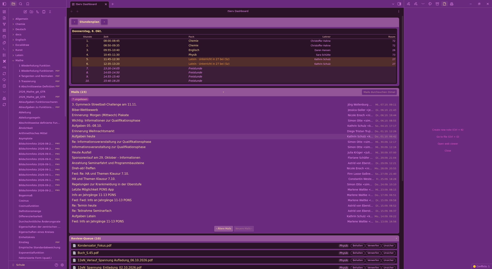

# Issue #12 Teil 2c — Konzept-NEU live: Stundenplan-Whitelist + Vault-Duplikat-Filter + Ordner-Drop

**Datum:** 08.10.2026 · **Commits:** UI-Integration in `src/main.ts` (feedQueueFromFiles) · Screenshot: `docs/proofs/issue12-konzept-neu-queue.png`

## Beweis-Aussage

Nach Deploy + Plugin-Reload + Core-Trigger am laufenden Obsidian (ECHTES IServ + ECHTER Vault):

1. **Queue-Feed meldet `queue-feed: 0 neu, 0 patched, 98 gedroppt`** — der Bestands-Pflege-Loop
   warf 98 bereits-im-Vault-Items aus der Queue (unter ihnen `Groups/O Kunst 12gN Gh/Musteranalyse Rembrandt.pdf`).
2. **Rembrandt weg:** vor dem Fix `rembrandtInQueue: 1` (`status "neu"`) → nach dem Fix `rembrandt: 0`,
   `inVaultAfterDrop: 0` (KEIN Queue-Item matcht noch eine Vault-Datei), Queue 379 → 281 Items, 10 "neu".
3. **Stundenplan-Whitelist aktiv:** alle 10 Neu-Items stammen aus Ordner `Groups/O {Chemie 12eN Hn,
   Englisch 12gN Ha, Physik 12eN Sü}` = Teilmenge der live gefetcheten Stundenplan-Kurse
   (heute: Physik/Englisch/Chemie/Latein; morgen: + Mathe/Deutsch/Kunst/Politik) — `outsideTimetable: []`.
4. **Kein "auto"-Typ mehr im Feed:** frisch gefeedete Items sind status `"neu"` (Threshold-Fenster weg).

Screenshot (Dashboard mit Stundenplan-Tab + Review-Queue (10), Physik-Rows mit Behalten/Verwerfen/Unsicher):



## Eval-Beweiskette (obsidian-cli, laufendes Obsidian, Plugin via disable/enable gereloadet)

```
[vorher]  {"before":379,"neu":18,"rembrandtInQueue":["Groups/O Kunst 12gN Gh/Musteranalyse Rembrandt.pdf"]}
[core.trigger]  [iserv] queue-feed: 0 neu, 0 patched, 98 gedroppt
[nachher] {"total":281,"rembrandt":0}
[nachher] {"total":281,"neu":10,"inVaultAfterDrop":0,
           "folders":["Groups/O Chemie 12eN Hn","Groups/O Englisch 12gN Ha","Groups/O Physik 12eN Sü"]}
[stundenplan live] today: O Physik 12eN Sü, O Englisch 12gN Ha, O Chemie 12eN Hn, O Latein 12gN Sz
                   tomorrow: + O Mathe 12eN Kü, O Deutsch 12gN Dt, O Kunst 12gN Gh, O Politik 12gN We
[subset-check]   {"outsideTimetable":[]}
```

## Rembrandt-Root-Cause (User-Befund „bereits importierte Dateien werden noch vorgeschlagen")

- Vault-Realität (live): `Kunst/Musteranalyse Rembrandt.pdf` existiert (`getAbstractFileByPath` → path).
- Der FEED-Filter `existsInVault` verhinderte die **Neu-Anlage** korrekt (`0 neu`) — aber das ALT-Item
  aus queue.json (status `"neu"`, vor dem Filter angelegt) blieb stehen: die Bestands-Pflege loopte
  nur Subjects. Fix: derselbe basename-normalisierte Vault-Match jetzt auch im Pflege-Loop → `removeItem`.
- Normalisierung: `normalizeVaultName` = `normalizeName` (lowercase, Umlaute aufgelöst, Nicht-a-z raus).
  False-Positive-Risiko: zwei VERSCHIEDENE Dateien, die nach Normalisierung kollidieren (z. B.
  „Analyse 1.pdf" in Chemie UND Kunst) — akzeptiert pro Konzept („alle Fach-Dokumente ohne Duplikat");
  ein Vault-Dateiname ist ohnehin pro Pfad eindeutig, Kollisionen betreffen nur Quer-Fach-Gleichnamige.

## Konzept-NEU-Wiring (src/main.ts, feedQueueFromFiles)

- `courseFolderFilter` = `unionTodayTomorrow(coursesFromEntries(...))` aus `fetchJsonDay` (heute+morgen,
  best-effort: Stundenplan-Fehler → Alt-Feed ohne Filter).
- `deniesFolder` = `DeniedFoldersStore.isDenied` (lazy init, fail-open, fs-Gate: loadData/saveData).
- `existsInVault` = basename-normalisierter Match gegen `app.vault.getFiles()`.
- Bestands-Pflege: Vault-Duplikate JEDERZEIT raus (gleiche Normalisierung wie Feed).

Tests: 735/735 grün, `tsc --noEmit` clean.
